# 开掼六六六操作手册

版本：V1.0

截图说明：本手册使用Codex Computer Use操作浏览器，运行项目原始小游戏构建产物及现有Canvas适配层，连接本机真实游戏服务。截图为本地运行演示，不是小米14真机或微信开发者工具截图；输入键盘由浏览器弹窗模拟。截图中“六人掼蛋”为当前界面名称，对应登记软件“开掼六六六”的简称。

## 一、相关文档

| 文档名称 | 对应项目资料 | 内容 |
| --- | --- | --- |
| 总体设计参考 | README.md；六人掼蛋小程序 PRD v1.0.md | 产品定位、六人组队和运行方式；旧PRD与当前版本不同处以当前实现为准。 |
| 详细设计参考 | shared/types.ts；shared/cards.ts；server/game.ts；game-src/runtime.ts | 房间状态、牌型比较、回合、贡还贡及界面操作；项目未单独编制详细设计文档。 |
| 测试案例参考 | tests/game.test.ts；tests/cards.test.ts；tests/minigame.test.ts；tests/arrangement.test.ts | 规则、状态变化、小游戏操作和手牌整理的自动化测试案例。 |

## 二、说明

开掼六六六是一款供六位玩家在线组局的掼蛋微信小游戏。每局使用三副扑克牌，共162张，每人27张。六个座位按A队、B队交替排列，三人组成一队。玩家通过房间号或好友邀请加入同一张牌桌，依次出牌，按照完赛名次计算胜队和升级结果。

需要独自熟悉六人规则时，可选择“体验一局 · 五位机器人”。好友对局则通过创建房间、分享邀请和准备完成组局。机器人用于玩法体验，不代表高水平对手。大厅和牌桌横屏展示，本人位于底部，手牌单排重叠排列，选中牌会抬起。

## 三、功能特点

好友房提供局数、计时和辅助功能开关。房主可在开局前安排座位，六人全部准备后才能开始。队伍由座位确定，换座时应同时查看A/B队标识。

手牌支持点选、滑选、排序、提示和分组整理。理牌将实体牌整理为互不重叠的组合，玩家仍需自行确定打法并点击出牌。记牌只根据公开出牌及本人手牌计算，不展示他人手牌。

每局结束展示六人名次、胜队和等级变化。下一局按规则处理贡还贡或抗贡。返回前台后可恢复当前房间，大厅“我的战绩”记录本人参与的牌局。

## 四、系统要求

| 项目 | 运行条件 |
| --- | --- |
| 登记运行硬件 | 小米14，由用户提供。 |
| 客户端 | 微信小游戏运行环境，支持横屏触控；项目未给出最低微信或手机系统版本。 |
| 网络 | 手机可访问所配置的游戏服务，联网对局期间保持网络可用。 |
| 服务端支持 | 独立游戏服务；项目要求Node.js 22.12及以上，由服务维护人员部署。 |

微信登录需要服务方配置对应账号。真实微信授权、原生分享接收及目标手机性能仍需在微信环境验收；登记运行硬件不等于已完成真机测试。

## 五、大厅登录与连接设置

打开小游戏进入大厅。左侧显示“规则”“连接设置”“我的战绩”，右侧显示昵称、“微信登录”“游客体验”。未登录时不能查看个人战绩。点击昵称按钮打开输入键盘，填写1至20字的名称并点击键盘“完成”，再选择登录方式。

成功后右侧显示当前昵称和创建、加入、体验房间等按钮。若弹窗提示“操作未完成”，应根据具体原因处理；昵称不符合要求时修改昵称，连接失败时先检查网络。微信登录未成功时，可主动选择游客方式体验，微信身份与游客身份没有绑定。

“连接设置”填写游戏服务地址。地址须包含协议、不带路径；正常使用填写服务提供方的HTTPS地址。开发版仅允许本机或局域网地址使用HTTP。输入完成后显示保存结果，再登录或进入体验房间检查连接。

身份和上次房间按服务地址分别保存。切换地址后昵称或记录不同，应先检查是否仍在原服务。切回原地址可使用对应身份和房间记录，不能用另一服务的六位房号直接进入原房间。

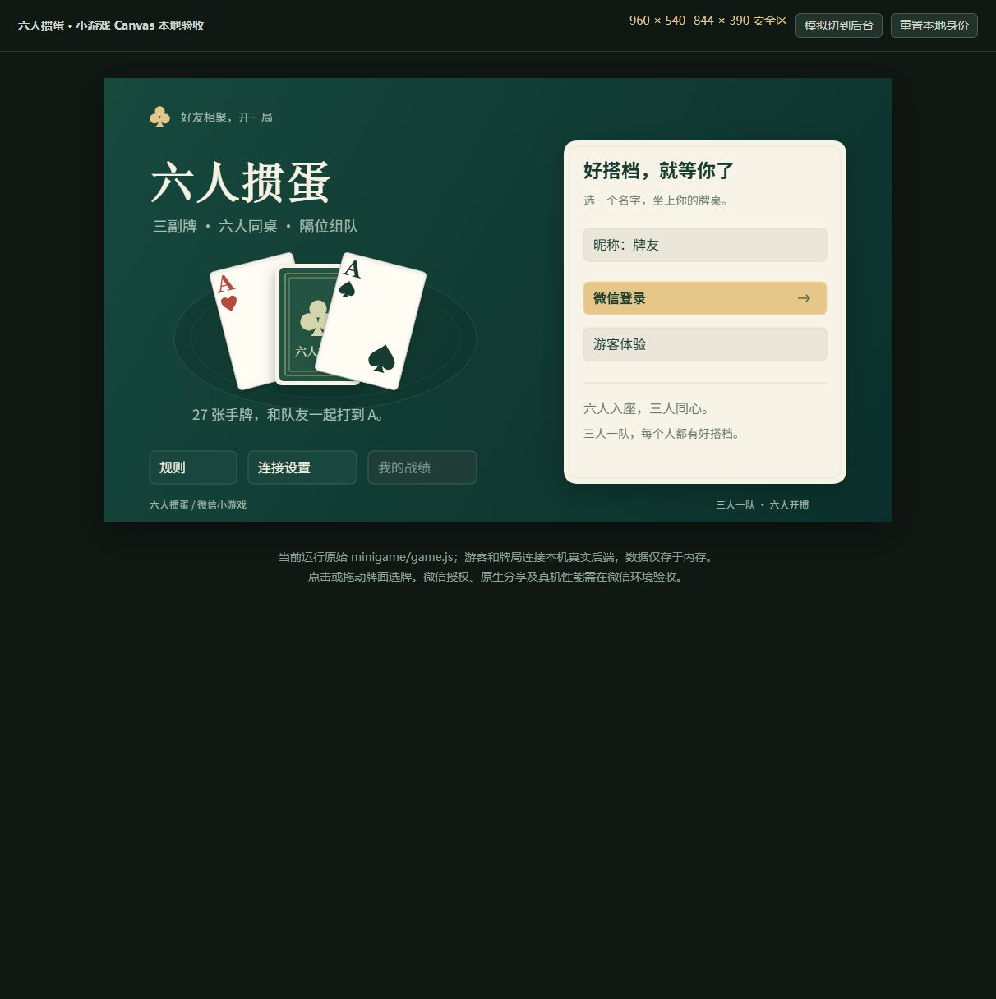

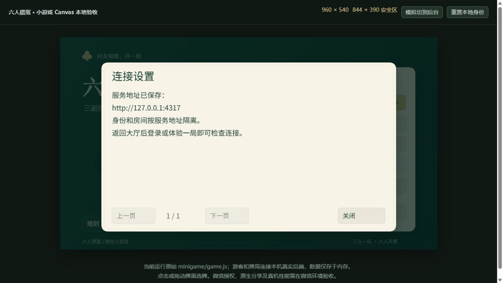

## 六、创建、加入与体验房间

登录后的大厅提供建房参数。局数可选1、2、4、8或打到A；计时可选不限时、15、30、60秒。“更多房间设置”可调整显示剩余牌数、允许托管、记牌器和抗贡，点击“完成”回到大厅。准备好参数后点击“创建房间”，设置作用于随后新建的房间。

好友已建房时，点击“输入房间号加入”，输入六位数字并完成输入。格式错误会提示“请输入六位房间号”，应重新核对。通过好友邀请打开时，大厅显示邀请房间，点击对应加入按钮。房间不存在、已满或身份不允许加入时，应按提示核对房间状态。

创建或加入成功后，牌桌顶部显示房号，桌面显示六席和A/B队伍。与好友核对同一房号后再准备。独自练习选择“体验一局 · 五位机器人”，成功后会看到标识为机器人的座位；体验局同样依赖游戏服务，不能在断网时作为离线游戏使用。

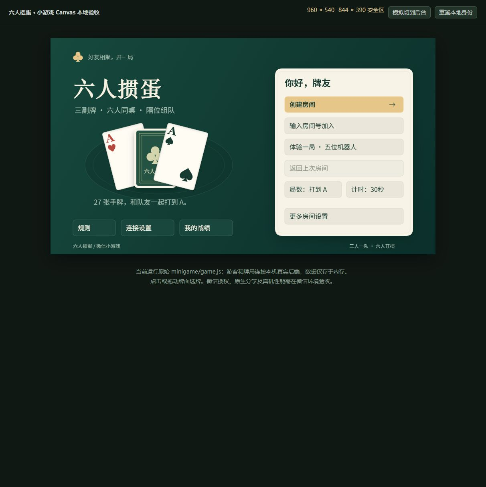

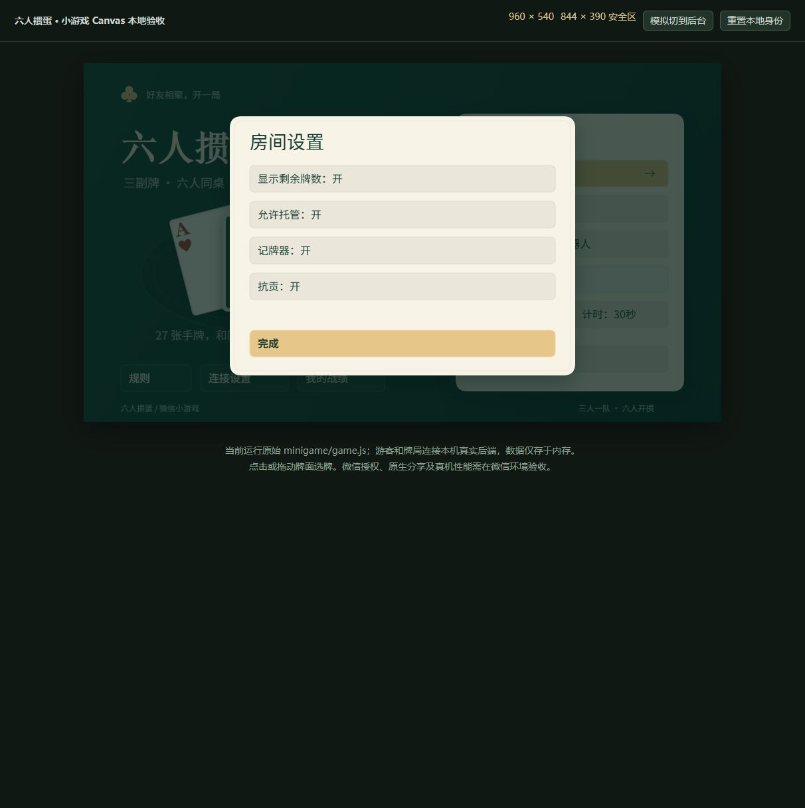

## 七、准备、邀请与座位调整

等待牌桌显示准备人数和各座位状态。点击“邀请”调用微信分享入口，接收者打开后完成登录并加入房间。分享是否成功送达，应以实际微信操作结果为准。

点击“准备”后按钮变为“取消准备”，准备人数更新。应先确认自己的队伍位置再准备。房主可点击“调整座位”，选择两个待交换的位置；已准备的玩家不能换座，需要先取消准备。房主也可在允许状态下使用“随机组队”，并查看重新排列后的队伍。

六人全部准备后，房主的“开始”按钮可用。点击后每人获得27张手牌，等待信息转为当前级牌和行动提示。非房主不能开局，坐满六席但未全部准备也不能开始。等待阶段返回大厅会让出座位，房主离开时会移交房主身份。

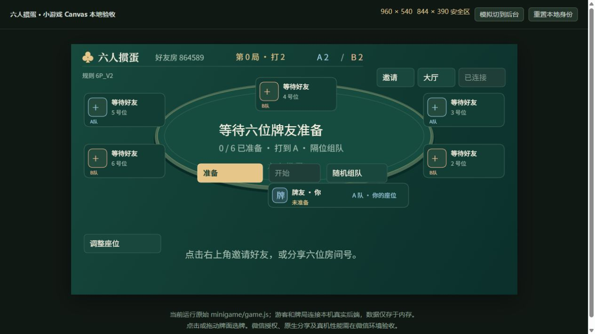

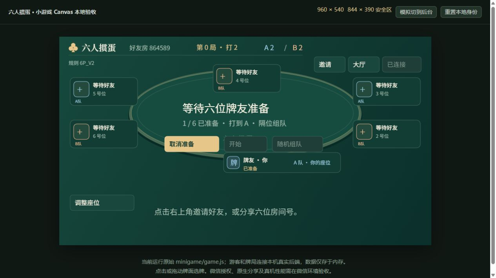

## 八、选牌、出牌与辅助操作

本人手牌位于屏幕底部，点击可选择或取消选择，滑动可连续操作经过的牌。选中牌抬起，牌面重叠时按照最上层可触及牌面命中。“清空”仅取消当前选择，不会丢弃手牌。按点数或花色排序可改变排列。

轮到本人时，可点“提示”查看候选组合，再次点击可循环切换。提示只选择牌，不会自动出牌。确认组合后点击“出牌”；成功后手牌减少、桌面出牌更新，回合转给下一位。没有可压组合时显示“没有能压过的牌”。无效组合或非本人回合时，“出牌”不可用。

跟牌时可在允许情况下点“不出”，本人获得首出权时不能不出。若提交失败，阅读提示并等待局面恢复后重新操作，不要连续重复点击。当前级牌、上家牌型及手牌变化都可能影响所选组合是否能打出。

房间允许时可开启托管，需要自己行动时点“取消托管”。设置了计时的房间显示剩余时间，超时执行规则允许的安全操作。“记牌”打开公开信息面板，只统计公开出牌和本人手牌；查看后关闭面板返回牌桌，并留意行动时间。

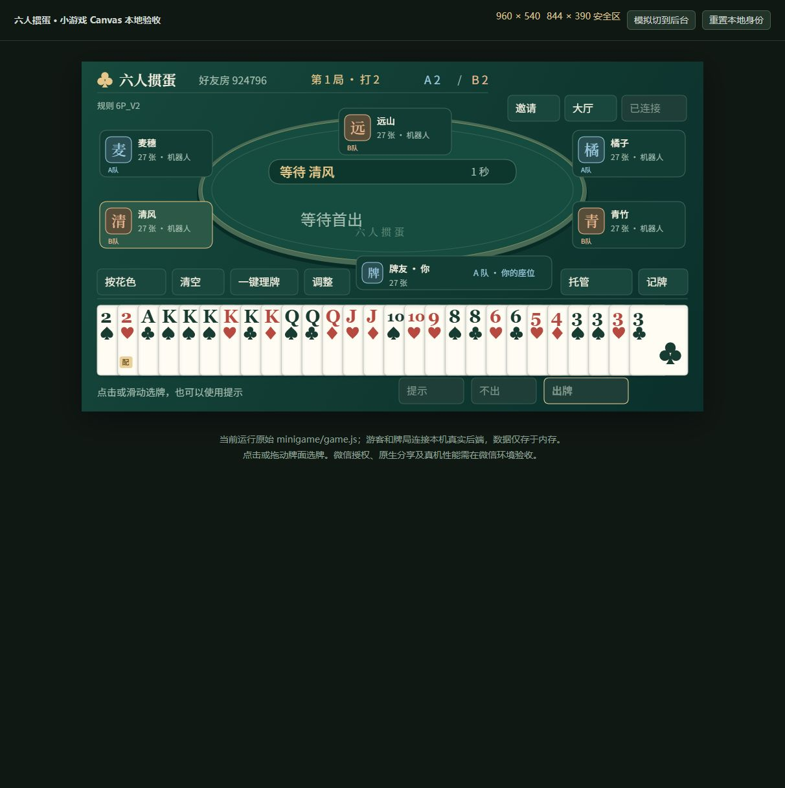

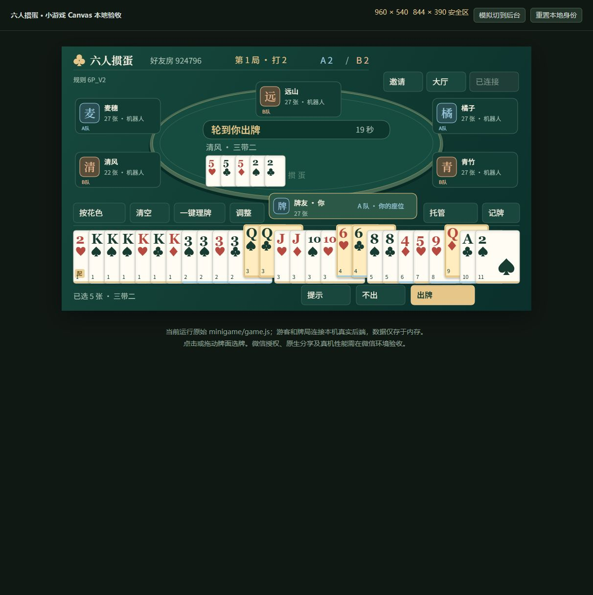

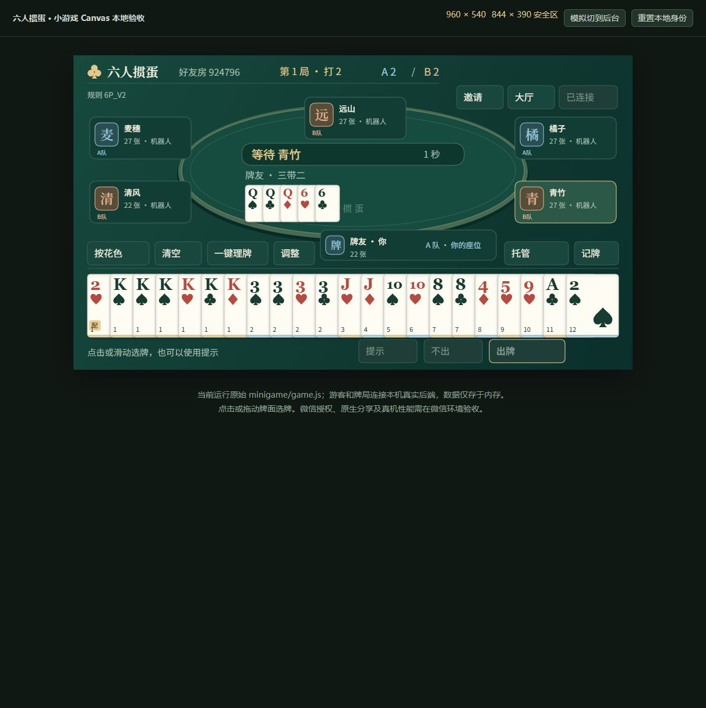

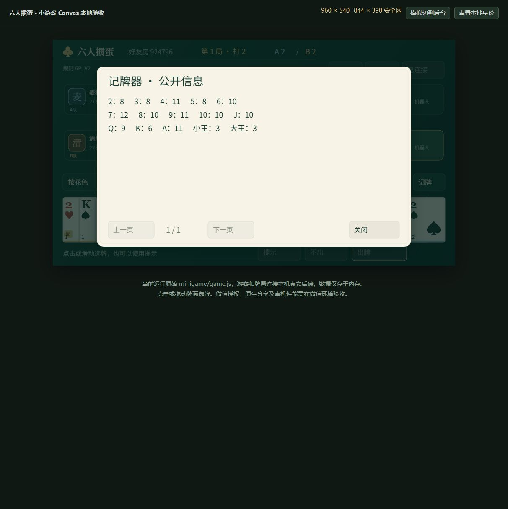

## 九、一键理牌与分组调整

点击“一键理牌”按当前级牌整理合法组合，并打开分组面板。手牌显示组号和分组底线，每张实体牌只归入一组。自动整理优先保留部分炸弹等组合，结果仅是整理建议，不保证最佳打法。

点组名可选中整组。“前移”“后移”改变排列，“拆组”拆开该组。也可在下方手牌点选或滑选，再点击“选牌成组”。不合法时提示“这些牌不能组成合法牌型，请重新选择”；手牌变化后应重新选牌。分组较多时用上页、下页查看。

需要重做时点击“重新自动理牌”，满意后点“完成”返回牌桌。分组不提交出牌动作，仍需点击出牌才能行动。按点数或花色排序可退出分组排列。出牌或交换后会清理失效牌并补入新牌，新一局重置；彻底关闭小游戏后需重新理牌。

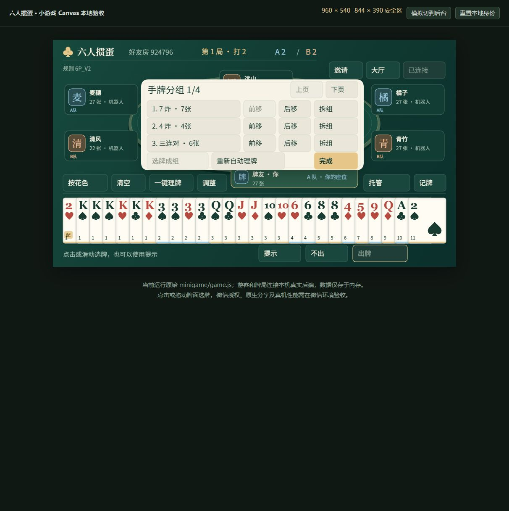

## 十、贡还贡与跨局结算

第五位玩家出完后，剩余一人记为末游。结算展示六人名次、获胜队伍及等级变化，头游所在队获胜。升级数按末尾名次的队伍分布确定。先查看排名和双方等级，再由房主在整场未结束时点击“下一局”。

需要交换时进入贡还贡阶段。进贡方点击“确认进贡”，软件按最大非逢人配牌处理。还贡方选中一张允许的手牌后点击“确认还贡”，优先使用2至9的非级牌；没有时按规则使用最小非逢人配牌，只有逢人配时使用允许的最小牌。

“交换进度”显示交换对象和完成状态，人数按升级数确定，最多三人。满足规定的大王数量时抗贡，不必重复交牌。交换完成后确定首出者并进入正常回合。还贡按钮不可用时，检查是否轮到本人交换、是否只选一张及牌值是否合规。

固定局数打满后整场结束；打到A须在本队A级且当前打A的一局获胜。结束后不能继续下一局，可查看最终显示的等级和排名，再返回大厅。固定局数结束尚未另设按总等级判定整场冠军的规则。

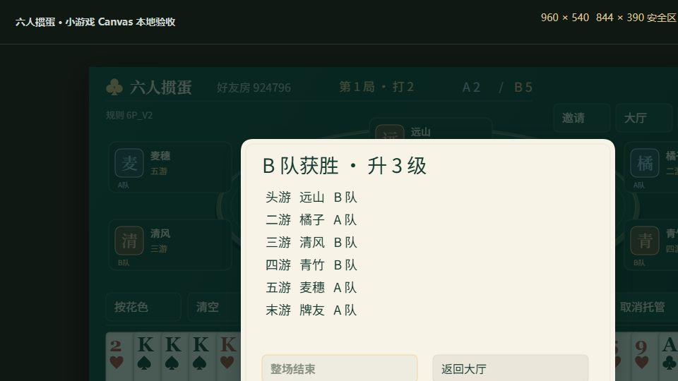

【截图预留：下一局还贡选择及交换进度。本次体验房固定一局，已完成结算但没有下一局入口，未捕捉贡还贡画面。】

## 十一、规则、战绩与房间恢复

大厅“规则”包含级牌、逢人配、牌型、升级、接风和贡还贡说明。用上一页、下一页翻阅，点关闭返回。新房间使用6P_V2，旧房间保留原规则时会在牌桌顶部提示版本，应按所在房间规则操作。

登录后打开“我的战绩”，可查看局数、获胜数、头游次数、最大炸弹及本人参与记录中的日期、房号、局次和排名。多条记录通过翻页查看。最大炸弹按实体牌张数统计，不能把张数直接当作王炸牌力排序。

切到后台后再返回，软件尝试恢复房间；牌桌断线时可点“重连”，大厅可点“返回上次房间”。恢复后先检查当前手牌和行动提示再操作。登录失效、房间不存在或无权查看时按提示处理，不能强行恢复。

进行中返回大厅保留座位，可按房间配置托管；等待阶段离开则让出座位。仍参与进行中牌局时不能同时进入另一局。找不到原房间时，应先核对服务地址及登录身份是否与原来一致。

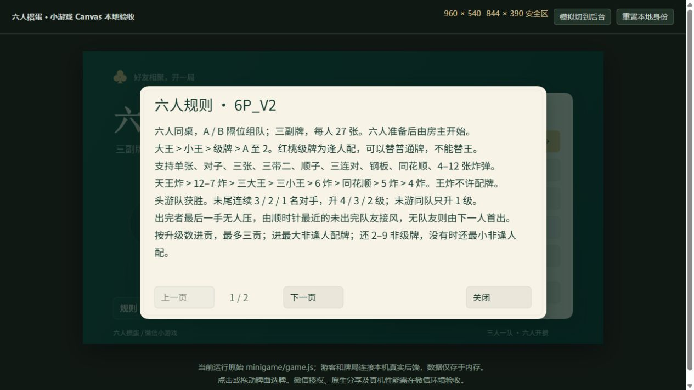

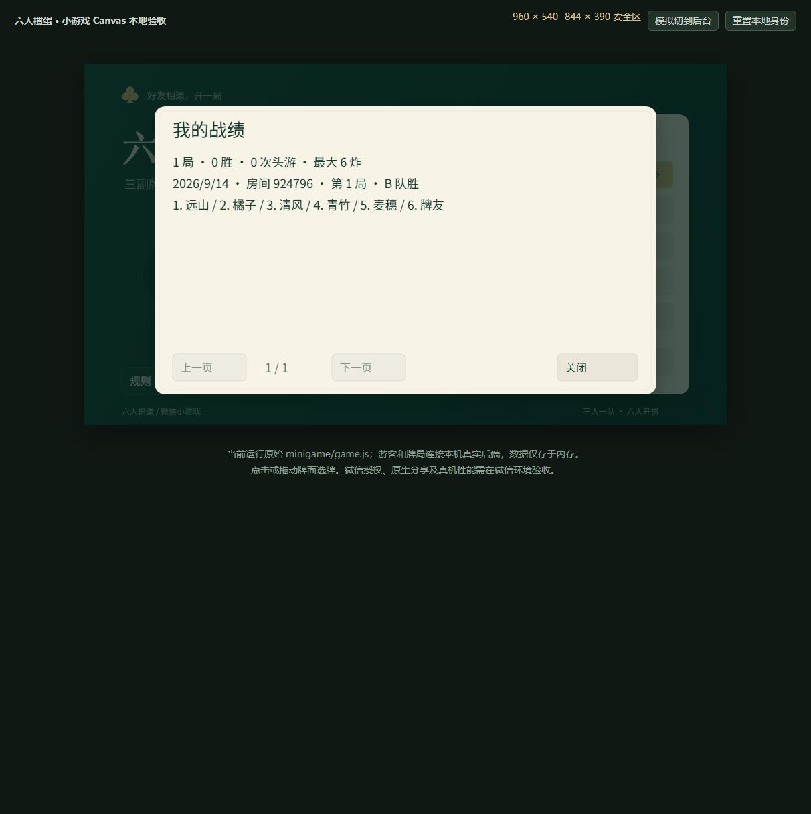

## 十二、常见问题解答

六席都有玩家却不能开始时，应检查六人是否全部准备，以及操作人是否为房主。仅坐满不能开始。

提示后手牌没有减少，是因为提示只帮助选牌；轮到本人且组合有效时还需点击“出牌”。

无法还贡时，应检查是否选了一张2至9非级牌；只有没有此类牌时才使用规则允许的回退候选。

切换服务地址后记录不同，是因为身份与战绩按服务分别保存。切回原地址，并核对使用原游客或微信身份。

连接失败时先检查手机网络和服务地址；若其他玩家也无法连接，应由维护人员检查服务状态。恢复后先看最新回合和手牌，避免重复操作。

## 十三、术语表

| 术语 | 解释 |
| --- | --- |
| 级牌 | 当前所打等级对应点数的牌。 |
| 逢人配 | 红桃级牌，可替普通牌和所需花色，不能替王。 |
| 头游／末游 | 本局最先／最后完成的名次。 |
| 接风 | 出完者最后一手无人压时，符合规则的队友或下一位获得首出。 |
| 进贡／还贡 | 跨局时按规则交牌及返还一张牌。 |
| 抗贡 | 满足规定大王数量时免于本次交换。 |
| 托管 | 软件按允许的规则代为行动。 |
